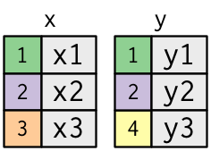
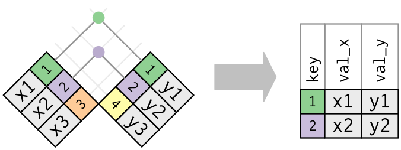
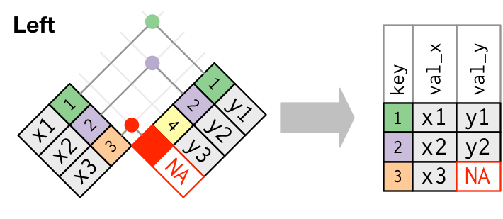
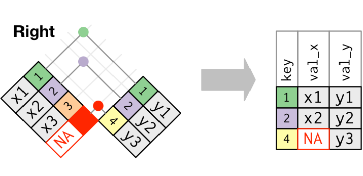
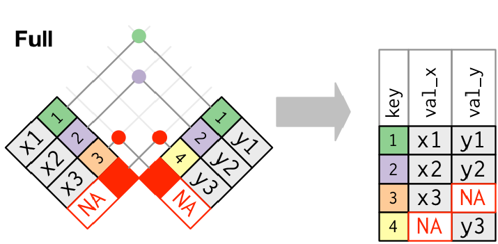
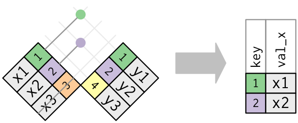
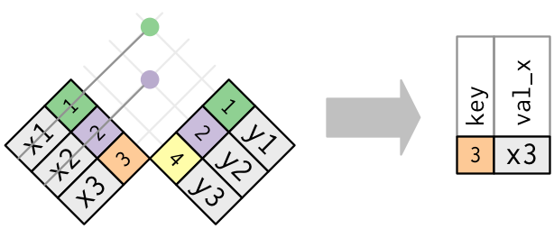

# Agenda {.center}

::: {.agenda-list}
1. Importing & Exporting Data in R 
2. Relational Data
:::


---

### Slides are in progress and will be updated before class.

::: {.content-hidden}


<!--
```{r, echo=FALSE, results='asis'}
cat('<span style="font-size: 0.8em; color: #666;">These slides were last updated on', format(Sys.Date(), '%B %d, %Y'), '</span>')
```

<span style="font-size: 0.8em; color: #666;">
*Slides last updated on **October 20, 2025**. Slides authored by Sabrina Nardin. AI used to polish slides style and fix typos.*
</span>

```{r pkgs, include = FALSE, cache = FALSE}
library(tidyverse)
library(nycflights13)
library(rcis)
library(knitr)
#library(here)
```


# 1. Importing & Exporting Data in R {.slide .center .middle}

---

## Importing CSV files

To load data into R we need **importing functions**. There are several of them depending on the **type of file** we want to import. See "R for Data Science" 2nd Ed. Chapter 7 for details.

**The most common importing functions read comma-separated values (csv) files.** Two main versions:

- from **base-R** we have `read.csv()`
- from **[`readr`](https://readr.tidyverse.org/)** we have `read_csv()`

They are similar, but we use `read_csv()` in this course because is more recent, faster, and does not automatically changes data types (e.g., does not convert characters into factors automatically). Type `?read.csv()` and `?read_csv()` in your Console for info.

<!-- `read.csv` is a special case of `read.table`, while `read_csv` is special case of `read_delim`. Look them up to check the differences -- r 
difference between using one ? and ?? in searching for doc
the ? find the exact match
the ?? finds the general match
-->

---

## The function read_csv()

This function takes several arguments, all listed in the [documentation]( https://readr.tidyverse.org/reference/read_delim.html). Some of the most common arguments are:

```r
read_csv(file, col_names = TRUE, col_types = NULL, na = c("", "NA"))
```

**The `file` argument must always be passed, the other arguments can be left as default:**

```r
library(readr)

# load data into my local R Studio, specifying the path
read_csv(file = "/Users/Sabrina Nardin/Desktop/testdata.csv")

# load data into my Workbench, specifying the path
read_csv(file = "/home/nardin/testdata.csv")

# load data (local R Studio or Workbench) without specifying the path 
# where does R look for this file?
read_csv("testdata.csv")

# load data if you are not sure where it is located (not reccomended)
read_csv(file = file.choose())
```

<!--
Make sure the file is located in the given path and you are typing the path correctly. Let's practice!
-->

---

## 💻 Practice: Load Data in R

1. Create a `testdata.csv` file with four columns (id, name, age, food) with different data types and some missing data. Save it on your desktop with a `csv` extension.

1. Open Workbench: upload the file to the server. Skip this step if you are using R on your machine.

1. Look at your current working directory by typing `getwd()` in the console. That's where R looks at files by default.

1. Load `library(tidyverse)` and import the data into R using `read_csv()`. If you do not provide a path, R looks in your working directory.

---

### Changing Default Arguments

In the next slides, we are going to modify some of the most common arguments of the `read_csv()` function. 

Let's start by using the function without modifying them, by simply typing `read_csv(file = "testdata.csv")`

What do you notice? 

<!--
This file is a good example of messy data!
type of column is shown at the top, e.g. id is double, name is char, but so is age, which should not be. Why so? the "na" is interpret as a character rather than missing data and all column values are forced to character.
-->

---

### Modify the col_types argument

The default is `read_csv(file, col_types = NULL)`. We can change it to manually set the column types, as shown below (two options):

```r
# option 1
read_csv(file = "testdata.csv",
         col_types = cols(id = col_integer(),
                          name = col_character(),
                          age = col_integer(),
                          food = col_character()))
# option 2
read_csv("testdata.csv", col_types = ("icic"))
```

Pick one option, and run the code in your Console to re-import the data. What do you notice?

<!-- all columns types have been converted to the datatype we specified. R is also guessing that the na in age is actually missing data and so converts it as such, but we get a warning message; type problems() to see more
-->

---

### Modify the na argument

The default is `read_csv(file, na = c("", "NA"))`. We can change it to add more missing data options, like that:

```r
read_csv("testdata.csv", col_types = ("icic"), na = c("", "NA", "na", "None"))
```

What do you notice? You can customize what goes into the vector `c()`

<!-- we can enlarge the set of missing data to include everything we want -->


---

### Modify the col_names argument

The default is `read_csv(file, col_names = TRUE)`. We can change it to `col_names = FALSE`, like that:

```r
read_csv(file = "testdata.csv", col_names = FALSE)

```

What do you notice?

<!-- first line is not more read as variable names -->

---

### Modify the skip argument


The default is `read_csv(file, skip = 0)`. We can change it to `skip = 2` or any to any other integer.

```r
read_csv(file = "testdata.csv", skip = 2)

```

What do you notice?

Useful when your data contain problematic rows. Note that `read.csv()` (base R) doesn’t support this option. If skipping lines doesn’t work, make sure you’re using `read_csv()` from `readr`

---

## Takehome

Importing files correctly is important as it prevents problems that might emerge later!

Check the function arguments: there are many of them available that can help you accomplish almost anything you need!

*Let's clarify a few additional concepts related to importing and exporting data...*

---

## Working Directory

The working directory is the folder that R takes as **default directory** every time you try to load a file, script, etc.

To check your current working directory: start a new session of R and type `getwd()`. In Workbench it should be `"/home/your_cnetid"`

---

## Relative Path vs. Absolute Path


When you import a file (for example, from the *Workbench “Files” tab*) into R, you should use a **relative path** instead of a **full (absolute) path**.

::: {.columns}

::: {.column width="50%"}

### Relative Path  

- Means relative to your R project folder (the one containing your `.Rproj` file)  
- Recommended approach: easier and makes your code portable  
- Works only if the file is inside R’s default working directory  

```r
read_csv("testdata.csv")
```

:::

::: {.column width="50%"}

### Absolute Path  

- Means you specify the entire path to reach the file, independent from specific folders  
- Avoid this: it breaks if someone runs your code from another machine or folder  
- Independent on R's default working directory  

```r
read_csv("/home/nardin/testdata.csv")
```

:::

:::

<!--
You can also manually set your directory to an absolute path, for example using `setwd()` but that is not the best approach for reproducible. Use relative paths instead!
-->

---

## Easier Solution: Use RStudio Projects

::: {.callout-tip}

### RStudio Projects `.Rproj`

RStudio Projects automatically set the working directory for you, based on the active project:

- ensures portability across computers and a reliable behavior!
- you do not need to set the working directory manually
- but you need to check in which project you are working

:::

**Example:** Each *homework* and *in-class exercise* folder in this course contains a `.Rproj` file. When you open that project in RStudio, the working directory is automatically set to that folder.

**Tip:** If you switch to another project, RStudio automatically updates the default working directory for you. Always check which project you’re working in.

<!-- for HW3, released tmr, we are asking to load data, we will be giving you a rproj like in HW2, so all you have to do to load teh data is to be in the correct project and then use a relative path with the name of the data.csv
-->

---

## 💻 Practice: Create an RStudio Project

Step 1: Open RStudio and navigate to the top-left menu. Then File > New Project...

Step 2: Choose New Directory, then select New Project

Step 3: Name your project and save it.

Step 4: Click Create Project. RStudio will open a new session within your project environment. Done!

Step 5: Let's test it! In your new project, create a new R script or R Markdown document and inside it type and run `getwd()`. What do you notice?

---

## Other readr functions to import data 

The `readr` package include several functions to load into R almost all possible file formats that you might encounter (when given an option though, choose a `csv` over other formats). 

For example:

* **Comma separated csv** use `read_csv()` from the `readr` package
* **Semi column separated csv** use `read_csv2()`from the `readr` package
* **Tab separated files** use `read_tsv()`from the `readr` package
* **RDS** use `readRDS()` or `read_rds()`
* **Excel** use `read_excel()` from the `readxl` package
* **SAS/SPSS/Stata** use the `haven` package (several functions)

Cheat Sheet for `readr`:
**Help > Cheat Sheets > Browse Cheat Sheets**

---

## Using haven with SAS

```r
library(haven)

read_sas(data_file = system.file("examples", "iris.sas7bdat",
  package = "haven"
))
```

---

## Using haven with SPSS

```r
read_sav(file = system.file("examples", "iris.sav",
  package = "haven"
))
```

---

## Using haven with Stata

```r 
read_dta(file = system.file("examples", "iris.dta",
  package = "haven"
))
```

---

## Exporting data with write_csv()

So far we talked about **IMPORTING DATA** with `read_csv()` from `readr`

But`readr` has also several functions for **EXPORTING DATA**. The most common is `write_csv()` which **generates csv files from R data frames**: https://readr.tidyverse.org/reference/write_delim.html

```
# import
test <- read_csv("testdata.csv", col_types = ("icic"), na = c("", "NA", "na", "None"))

# write your data analysis and visualization code etc.

# export 
write_csv(test, file = "testdata_cleaned.csv")
```

# 2. Relational Data with dplyr {.slide .center .middle}

---

## Definition of Relational Data

**Relational Database:** set of multiple "tables" that are linked based on data common to them. You can think of a "table" as a dataframe.

**These tables provide meaningful insights only when combined together!**

Answers to research questions are not defined by individual rows or columns in a single table; rather, they emerge from the relationships among tables.

<!--
why you want to do so? e.g. store data in different tables?
Data you need for the analysis is not and cannot be stored in one single table but it is split across tables; usually two but potentially more
-->

---

## Our Focus

There are several software and languages to deal with relational databases. The most common is SQL but that's beyond our course. For more on this, see ["Chapter 21 Databases"](https://r4ds.hadley.nz/databases) from our book.

**R also allows you to join tables using the `dplyr` package. That's our focus!**

<!-- dplyr for relational data focuses on joining tables; it is basically merging data and no really needing sql terminology and concepts (e.g., table, attributes, relations) but there is value in using them, as explained in the assigned readings from today, which is Ch 19 joins from the book

So we do a mini theoretical intro to relational databases logic and terminology and then we move to dplyr
-->

---

## We use the flights example from the readings

`library(nycflights13)` in ["Chapter 19 Joins"](https://r4ds.hadley.nz/joins) from "R for Data Science" 2nd Edition. 

We have five tables (e.g., five distinct datasets):  

* `flights` info about flights, identified by multiple variables  
* `airlines` each airplane company name, identified by the abbreviated `career` code  
* `airports` info about each airport, identified by the `faa` code  
* `planes` info about each plane, identified by its `tailnum` number  
* `weather` info about the weather at each NYC airport for each hour, identified by various variables  

Load the data into R (package already installed on Workbench): `library(nycflights13)`

---

## We use the flights example from the Readings

Visual representation of the relations among the 5 tables in `nycflights13`:


```{r out.width="60%", echo = FALSE}
include_graphics(path = "10-pics/relational-nycflights.png")
```

To understand diagrams like this, remember that each relation concerns a **pair of tables**. 

---

### Formal definitions 

A **KEY** of a table is a one or a subset of columns (formally called "attributes"). Two types of keys:

* **PRIMARY KEY**
uniquely identifies an observation in its own table; e.g., `tailnum` is the primary key of the `planes` table; a primary key can be one or multiple columns.

* **FOREIGN KEY**
matches the primary key of another table; e.g., `tailnum` is a foreign key in the `flights` table (it links each flight to a unique plane by matching the tantalum primary key from the planes table

<!--
A variable can be both a primary key and a foreign key. For example, origin is part of the weather primary key, and is also a foreign key for the airports table. 
-->

A **RELATION** is defined between **pairs of tables**: primary key + foreign key in another table.

<!--
Relations can be
* one-to-one
* one-to-many: each flight has one plane, but each plane has many flights
* many-to-many
-->


---

## In pratice... when using dplyr to work with relational data, we have:

### 1. Mutating joins

### 2. Filtering joins

---

## 1. Mutating joins

This group includes:

- **inner join**: keeps observations that appear in both tables

- **outer join**: keeps observations that appear in at least one of the tables  

  * **left join**: keeps all observations in left table  
  * **right join**: keeps all observations in right table  
  * **full join**: keeps all observations  

---

## inner_join()

Keeps obs. that appear in both tables, identified by keys (colored numbers). Unmatched rows are dropped.

::: {.columns}
::: {.column width="45%"}
{width=90%}
:::

::: {.column width="55%"}
<br>
<br>
{width=100%}
</br>
</br>
:::
:::

<br>

```r
# inner_join example
inner_join(x, y, by = "key")

# with pipes
x %>% inner_join(y, by = "key")

# if the join columns have different names
inner_join(x, y, by = c("a" = "b"))
```

</br>

<!-- by convention, x is assigned as the first dataframe or left one, and y as the second or right one; 

the by argument specifies that we are joining it based on the key column (which you cannot see from the slide but its the column name of the colored columns in each x and y). Compare this to the left_join() operation which is another form of mutating join
-->

---

## left_join()

Keeps all obs. in the left table (x), even if there is not a match in the right table (y).

::: {.columns}
::: {.column width="45%"}
{width=90%}
:::

::: {.column width="55%"}
<br>
{width=100%}
</br>
:::
:::

<br>

```r
left_join(x, y, by = "key")
```

</br>

---

## right_join()

Keeps all obse. in the right table (y), even if there is not a match in the left table (x).

::: {.columns}
::: {.column width="45%"}
{width=90%}
:::

::: {.column width="55%"}
<br>
{width=100%}
</br>
:::
:::

<br>

```r
right_join(x, y, by = "key")
```

</br>

<!-- same thing as left join but reversing the order of the data frame or table
typically right join is utilized less because by convention we think at the left or x table as the primary  data for these kind of operations 
-->

---

## full_join()

Keeps all obs., matches and non-matches (e.g., more missing values).

::: {.columns}
::: {.column width="45%"}
{width=90%}
:::

::: {.column width="55%"}
<br>
{width=100%}
</br>
:::
:::

<br>

```r
full_join(x, y, by = "key")
```

</br>

---

## Venn Diagram 

```{r out.width="60%", echo = FALSE}
include_graphics(path = "10-pics/join-venn.png")
```

---

## Filtering joins

Other than mutating joins, `dplyr` has filtering joins;

- **semi_join**: keeps all observations in x that have a match in y
- **anti_join** drops all observations in x that have a match in y

Essentially these function use information from the second data frame (y) to filter observations from the first data frame (x).

---

## semi_join()

Keeps all obs. in x that have a match in y. Only keeps columns from the first table you pass in the code (x).


::: {.columns}
::: {.column width="45%"}
{width=90%}
:::

::: {.column width="55%"}
<br>
<br>
{width=100%}
</br>
</br>
:::
:::

<br>

```r
semi_join(x, y, by = "key")
```
</br>

---

## anti_join()

Drops all obs. in x that have a match in y. Only keeps columns from the first table you pass in the code (x).


::: {.columns}
::: {.column width="45%"}
{width=90%}
:::

::: {.column width="55%"}
<br>
<br>
{width=100%}
</br>
</br>
:::
:::

<br>

```r
anti_join(x, y, by = "key")
```

</br>

---

## 💻 Practice working with relational data with dplyr

Download today's in-class materials from the website (`relational-data.Rmd`)

---

## Recap: What We Learned Today

- How to import data with `read_csv` and export data using `write_csv`
- How to work with relational data using `dplyr`

---

## To print these slides as pdf

Click on the icon bottom-left corner (the three lines) \> Tools \> PDF Export Mode \> Print as a Pdf


:::